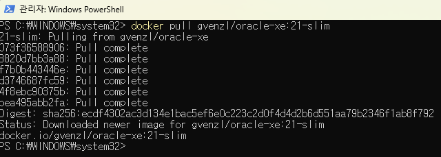
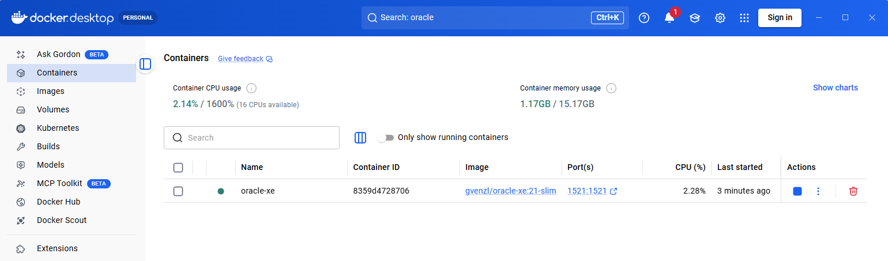
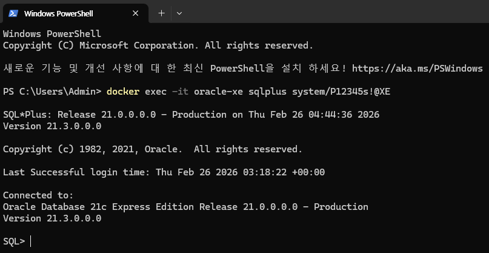
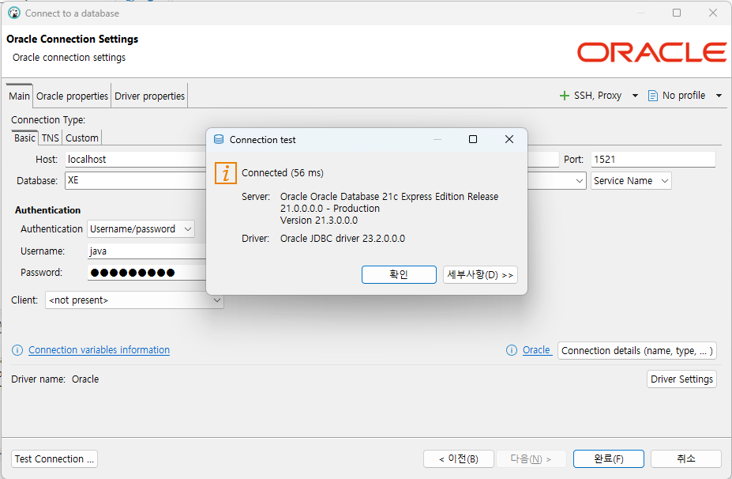
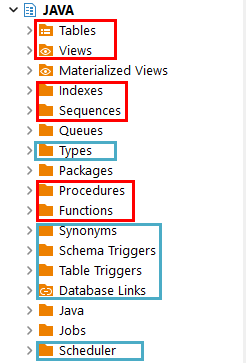

# java-database-2026
자바개발자 과정 데이터베이스 레포지토리

## Day01

### 데이터/정보

데이터는 단순한 컴퓨터 환경의 특정 값을 의미, 정보는 데이터에 의미를 부여한 것

### 데이터베이스(DataBase : DB)

데이터를 기반으로 하는 관리 시스템을 의미. 데이터를 모아둔 장소를 의미하기도 함.

- DataBase Management System을 줄여서 DBMS라고 부름
- DBMS를 줄여서 DB라고도 함
- 대부분 기업의 `도메인 정보`를 저장하고 있음
- IT에서 가장 중요하게 생각해야할 기술 중 하나.


### 데이터베이스 종류
- 관계형 데이터베이스(RDBMS)
    - `Oracle` - 학습할 DB
    - SQL Server - Microsoft사 제품. Oracle보다 성능이 낮음
    - MySQL - 오픈소스 진영에서 Oracle로 합병
    - MariaDB - MySQL 개발자들이 다시 만든 오픈소스 DB
    - PostgreSQL - 오픈소스 데이터베이스

- NoSQL 데이터베이스(빅데이터...)
    - Redis
    - MongoDB
    - Apache Cassandra

- In-Memory 데이터베이스
    - SAP HANA(매우 빠름)

### 오라클 설치 방법
1. 로컬 설치


2. 도커 설치(클라우드 동일)


### 오라클 설치 이전

1. 도커 설치 - DevOps의 필수품
    - https://www.docker.com/
    - Download Docker Desktop(AMD64) 버튼 클릭

2. 설치 후 실행
    - Settings 클릭
    - Start Docker Desktop when you sign in to your computer

### 오라클 설치

1. Docker Desktop에서 검색 후 Pull로 이미지 다운로드 가능 - 하지말 것

2. Docker Command 사용
    - Powershell 오픈 후, 도커 실행 확인
        
        ```bash
        docker --version
        Docker version 29.2.1, build a5c7197
        ```

    - 이미지 검색
        ```bash
        docker search oracle-xe
        PS C:\WINDOWS\system32> docker search oracle-xe
        NAME                      DESCRIPTION                                      STARS     OFFICIAL
        gvenzl/oracle-xe          Oracle Database XE (21c, 18c, 11g) for every…   355
        owncloudci/oracle-xe                                                       0
        abstractdog/oracle-xe                                                      0
        ```

        - 이미지 당겨오기

            ```bash
            docker pull gvenzl/oracle-xe:21-slim
            ```
            

        - 컨테이너 실행

            ```bash
            docker run -d --name oracle-xe -p 1521:1521 -e ORACLE_PASSWORD=P12345s! gvenzl/oracle-xe:21-slim
            ```

            

        - 멈춰있는 컨테이너 실행
            ```bash
            docker start [컨테이너ID]
            ```

        - 컨테이너 자동실행 명령
            ```bash
            docker update --restart=always [컨테이너 ID]
            ```

        - 컨테이너 내부 접속

        ```bash
        docker exec -it oracle-xe sqlplus system/P12345s!@XE
        ```

        

    - 강의용 사용자 생성

        ```sql
        CREATE USER java IDENTIFIED BY java12345!;
        GRANT CONNECT, RESOURCE TO java;
        GRANT CREATE TABLE TO java;

        GRANT all privileges TO java;
        ```

### 데이터베이스 개발 툴 DBeaver 설치

1. 개발 툴 종류
    - SQL*PLUS - 콘솔개발 화면, 가장 기초적인 SQL 실행도구. 매우 사용불편
    - Oracle SQL Developer - 오라클사가 제공하는 무료 툴. 오픈소스. java 개발 툴 eclipse를 커스터마이징해서 개발
    - Toad for Oracle - DB 개발 툴 가장 강력한 SW. 상용 라이선스.
    - `EBeaver` - 오픈소스, 거의 모든 DB를 다 사용. 대중성이 매우 높음

2. DBeaver 설치
    -https://dbeaver.io/

3. VS Code 확장
    - Database Client, Database Client JDBC
### DBeaver 사용법

- Database Navigator에서 DB연결 시작

    

    - 마우스 오른쪽 버튼 > Create > Connection
        
        

    - 연결정보 입력 Test Connection
    
    - 입력 시 주의사항: Port 번호 확인, Database 이름 변경 Oracle -> XE로, Username, Password 일치
        

### 기본 사용법

 - DBeaver
    - 연결된 XE - java > Schema(Database와 같은 의미) 확장 > JAVA 선택
    - 마우스 오른쪽 버튼 > SQL 편집기

 - 샘플 데이터베이스 생성
    
    1. 테이블 생성 : [쿼리](./day01/1.sample_schemas.sql)
    2. 시퀀스 생성 : [쿼리](./day01/2.sequences.sql)
    3. 부서데이터 추가 : [쿼리](./day01/3.department_datas.sql)
    4. 직원데이터 추가 : [쿼리](./day01/4.employee_datas.sql)
    5. 고객데이터 추가 : [쿼리](./day01/5.customer_datas.sql)
    6. 상품데이터 추가 : [쿼리](./day01/6.product_datas.sql)
    7. 주문과 주문상세데이터 추가 : [쿼리](./day01/7.order_order_item_datas.sql)

- 간단 연습 : [쿼리](./day01/8.샘플쿼리.sql)
    - DB 파일은 확장자를 `.sql`
    - 하나의 명령으로 ;으로 끝나는 문장을 쿼리(query)로 지칭
    - 쿼리문은 대소문자 구분없음
    - DBeaver에서 쿼리 한 줄 실행은 Ctrl+Enter
    - 여러줄 동시실행은 Alt+x

 - SQL(Structured Query Language)
    - 구조화된 질의 언어
    - 관계형 데이터베이스에서 DBMS상에 데이터를 정의, 조작, 제어하기 위해 사용하는 표준 프로그래밍 언어

## Day02

 ### DBeaver 사용법, DB작업시 사전지식
 - 메뉴 상 용어들
    - 검색 > `DB Full-Text` - Full Text Search(대용량 텍스트 내에서 필요한 단어를 검색할 때)
    - SQL 편집기 > `실행계획` - 현재의 쿼리가 실행되는데 비용이 얼마나 발생하는지 파악하는 기술. 최적화 실행속도 빠르게 하기 전에 분석
    - 데이터베이스 > `트랜잭션` 모드 - 쿼리들이 실행되는 논리적 덩어리, Auto-Commit(조금 위험), None Commit



- 위 스키마 하위에서 지금 알아야 할 내용들
    - 테이블
    - 뷰
    - 인덱스
    - 시퀀스
    - 프로시저
    - 펑션
    - SQL 문법까지

 ### 기본, SELECT문

 - 문법이전 데이터 타입
    - NUMBER 숫자타입, 최대 22byte
    - INTEGER - 정수타입, 모든 데이터 기초 4byte(-21억 ~ +21억)
    - FLOAT - 실수타입, 소수점 포함, 최대 22byte
    - CHAR(n) - Character 문자열타입, 고정형, 최대 2000byte
        - CHAR(20)기본 'Hello World'를 저장하면, 'Hello World&nbsp;&nbsp;&nbsp;&nbsp;&nbsp;&nbsp;&nbsp;&nbsp;&nbsp;'
    - `VARCHAR2`(n) - 가변형 문자열, 최대 4000byte
        - 오라클에서 VARCHAR(n)는 사용안함
        - VARCHAR2(20)으로 'Hello World'를 저장하면, 'Hello World' 뒤에 공백 9자리는 버림.
        - `LONG`(n) - 가변길이 문자열, 최대 26Gbyte
        - LONG RAW(n) - 바이너리(이진)데이터, 0과 1의 숫자로만 저장. 최대 2Gbyte
        - CLOB - 대용량 텍스트타입, 최대 4Gbyte
        - BLOB - 대용량 바이너리타입, 최대 4Gbyte
        - `DATE` - 날짜타입. 문자열과 다름

    - 데이터 조회 3가지 방법
        - `셀렉션`(Selection) - 행단위로 조회
        - `프로젝션`(Projection) - 열단위로 조회
        - `조인`(Join) - 두 개 이상 테이블을 조합해서 조회

 - SELECT 문법
    
    ```sql
    -- 주석 한줄 주석
    /* 여러줄
        주석 (c언어 주석) */
    -- 기본 문법
    SELECT [*|열이름 나열]
        FROM [dual|테이블명]

    -- 별명추가
    SELECT 컬럼명 [AS 별명], 
           계산식 AS "별명",
           ...
        FROM 테이블명 [테이블별명];

    -- 데이터 정렬
    SELECT 위와 동일
        FROM 테이블명
        ORDER BY [정렬할 열이름(여러개)][ASC|DESC];
    /*
    ASC - ascending(오름차순)
    DESC - descending(내림차순)
    */

    -- 조건절 WHERE절
    -- 원하는 조건으로 다양하게 조회할 때
    SELECT 위와 동일
        FROM 테이블명
    [WHERE 조회할 행을 선별하는 조건식]
    [ORDER BY [정렬할 열이름(여러개)][ASC|DESC]];
    ```

 - 오라클 함수: DB별로 추가학습 필요

    - 문자열 함수
        - UPPER, LOWER, INITCAP(첫글자만 대문자로)
        - LENGTH(문자열 길이)
        - SUBSTR(문자열,  시작, 길이)
        - INSTR(문자열, 찾을 문자열, [횟수]), 문자열에서 찾을 문자열의 위치를 리턴
        - REPLACE(문자열, 찾는 문자열, 바꿀 문자열), 찾은 문자열을 바꿀 문자열로 변경
        - LPAD(문자열, 자리수, 채울문자열), RPAD(문자열, 자리수, 채울문자열), L/R 기준으로 자리수만큼 빈공간 특정 문자로 채우기
        - CONCAT(앞쪽문자열, 뒤쪽문자열), 두 문자열 합치기
        - TRIM(공백이 있는 문자열), LTRIM(공백있는문자열), RTRIM(공백있는문자열), 문자열 앞뒤의 빈공백 제거

    - 숫자 함수
        - ROUND(반올림할수, 반올림 위치)
        - TRUNC(숫자, 버림위치)
        - CEIL(올림할수)
        - FLOOR(내림할수)
        - MOD(나머지 구할수)

### DB 특징

- 모든 언어는 인덱스가 0부터 시작
- 단, `데이터베이스는 인덱스 1부터` 시작!

## Day03

### 함수
- 날짜 포맷 단어
    - YYYY, YY - 년도 네자리(2026), 두자리(26)
    - MM, MON, MONTH - 월 두자리(03), MAR, MARCH
    - DD, DDD, DY, DAY - 일 두자리(03), 62(1월1일부터 며칠째), TUE(화), TUESDAY(화요일)
    - HH24, HH, HH12 - 24시간, 12시간, 12시간 표현
    - MI - 분
    - SS - 초

- 오라클 함수 계속
    - 날짜 함수
        - `sysdate` - 기본. 현재 일시를 리턴
        - `ADD_MONTHS`(날짜컬럼, 정수) - 양수는 이후달, 음수는 이전달
        - `MONTH_BETWEEN`(비교날짜1, 비교날짜2) - 두 날짜 사이의 개월 수
        - `NEXT_DAY`(날짜, '요일') - 날짜 이후의 해당요일 날짜 리턴
        - `LAST_DAY`(날짜) - 해당 날짜의 마지막일 리턴. 예)2월28일 3월 31일...

    - 형변환 함수
        `TO_CHAR`(날짜, '날짜포맷') - 날짜를 해당포맷에 맞게 변경해서 표현

    - NULL 처리함수
    - DECODE, CASE

### 데이터 그룹화

### Sample DB 생성

```bash
> docker exec -it oracle-xe sqlplus sys/oracle as sysdba

SQL*Plus: Release 21.0.0.0.0 - Production on Tue Mar 3 05:56:46 2026
Version 21.3.0.0.0

Copyright (c) 1982, 2021, Oracle.  All rights reserved.

Connected to:
Oracle Database 21c Express Edition Release 21.0.0.0.0 - Production
Version 21.3.0.0.0

SQL> alter session set "_oracle_script"=true;
SQL> create user scott identified by tiger
  2  default tablespace users quota unlimited on users;
SQL> grant connect, resource, dba to scott;
SQL> alter session set "_oracle_script"=true;
SQL> alter session set nls_date_language='american';
SQL> alter session set nls_date_format='dd-MON-rr'; 
```

### Day04

 - 관계형 데이터베이스
    - 관련된 데이터를 테이블 형태로 저장하고, 테이블간 관계를 통해 데이터를 관리하는 모델
    - 테이블 - 데이터를 저장하는 구조. Table/Entity
    - 행 - 관련 데이터가 모두 모인 하나의 데이터 행. Record/Row/Tuple
    - 컬럼 - 데이터 특징을 담는 하나의 속성, Column/Attribute
    - PK - 각 행을 유일하게 식별하는 키. 여러개의 PK를 가질수도 있음. Primary Key
    - FK - 부모테이블의 PK와 관계를 맺는 키 Foregin Key

- ERD(Entity Relationship Diagram)
    - 관계형 데이터베이스의 구조를 그림으로 표현한 설계도
    - 데이터베이스를 만들기 전에 어떤 테이블이 필요하고 어떤 관계를 맺어야 하는지 시각적으로 표현


 - ERD 설명
    - PK - DEPT>DEPTNO, EMP.EMPNO
    - FK - EMP.DEPTNO
    - 일반컬럼 - 그 외 나머지 컬럼
    - 부자관계 - DEPT(부), EMP(자)
     
 - 조인 계속
    - 등가조인 - `내부조인`, `Inner Join`, Equi Join
    - 비등가조인 - 등가조인 외의 방법, Between 등 사용. 많이 사용 안함
    - 셀프조인 - 자체조인. 자기 테이블을 조인. 자기 테이블내에 해당 PK와 관련있는 FK가 지정되어 있어야
        - 대부분 회사에서 조직도, 상사와 부하직원 관계를 볼 때 사용
    - 외부조인 - 등가조인 반대. `Outer Join` 조인 기준에서 일치하지 않는 데이터도 나오도록 하는 조인
        - 왼쪽외부조인 - `Left Outer Join`
        - 오른쪽외부조인 - `Right Outer Join`

### DML

- SQL문은 DML, DDL, DCL 구성

- DML
    - 데이터 조작 언어 - 데이터를 추가, 변경, 삭제, 
    - `SELECT`, `INSERT`, `UPDATE`, `DELETE`

 ## Day05

### DML 계속

## Day06

### DDL

- DDL 명령어 계속  - [쿼리](./day06/1.DDL.sql)
    - 5일차와 동일

### 객체 

- [쿼리](./day06/2.Object.sql)

- 데이터 사전 - 일반 테이블 외 DB를 운영하는 데 필요한 특수한 테이블
    - USER_XXXX - 현재 DB에 접속한 사요자가 소유한 객체 정보
    - ALL_XXXX - 사용허가를 받은 객체 정보
    - DBA_XXXX - DB 관리를 위한 정보(SYSTEM, SYS 사용자만 접근가능) 
    - V$_XXXX - DB 성능관련 정보

- 인덱스 
    - `Full Table Scan` - 모든 테이블 데이터를 처음부터 끝까지 찾아서 데이터 조회
    - Index Scan - 인덱스를 찾아서 해당 데이터를 조회
    - 실제 DB의 5% 용량이 추가됨. 인덱스 데이터를 저장하므로
    - 일정 시간마다 인덱스를 재정리. 데이터 쌓여가는 중간에도 재정리(시간소요)
    - 보통 SELECT WHERE절에서 자주 필터링 되는 컬럼에 인덱스를 걸면 속도개선
    - 대용량 데이터 (대략 몇천만건)에서 속도개선을 위해서 인덱스 사용

        ```sql
        -- 기본 문법
        CREATE INDEX 인덱스명
            ON 테이블명 (인덱스열1 ASC|DESC,
                            인덱스열2 ASC|DESC,
                            ... );

        -- 삭제
        DROP INDEX 인덱스명;
        ```

- 인덱스 종류
    - `단일` 인덱스 - 하나의 컬럼에 거는 인덱스
    - `복합` 인덱스 - 두개이상 컬럼에 거는 인덱스
    - `고유` 인덱스 - 열에 중복 데이터가 없을때 사용
    - `비고유` 인덱스 - 열에 중복 되는 데이터가 있을때
    - 함수기반 인덱스 - 산술식등으로 가공된 값을 인덱스로 사용 (연봉: SAL*12+COMM)
    - 비트맵 인덱스 - 데이터종류는 적고 같은 데이터가 많이 존재할때 사용하는 인덱스

- 뷰
    - 가상테이블을 만드는 객체
    - 물리적인 데이터를 따로 저장하지 않음
    - SELECT문의 복잡한 쿼리를 저장해서 간단하게 사용
    - 테이블 특정 컬럼(민감한 급여, 보너스, 주민번호)을 노출하지 않을 경우
    - `주의!` 보기위한 객체지만 한 테이블의 SELECT * 인 뷰 경우 INSERT 가능

        ```sql
        -- 기본 문법
        CREATE [OR REPLACE] VIEW 뷰이름 
            AS (저장할 SELECT문)

        -- 삭제
        DROP VIEW 뷰이름;
        ```

- 시퀀스
    - 오라클에만 존재하는 객체
    - 순번을 자동으로 매겨주는 기능

        ```sql
        -- 생성
        CREATE SEQUENCE 시퀀스명
        START WITH n
        INCREMENT BY p
        [MAXVALUE m | NOMAXVALUE]  -- NOMAXVALUE 10의 27승
        [MINVALUE o | NOMINVALUE]
        [CYCLE | NOCYCLE]
        [CACHE r | NOCACHE]

        -- 수정
        ALTER SEQUENCE 시퀀스명
        -- START WITH 이외 모두 사용가능

        -- 삭제
        DROP SEQUENCE 시퀀스명
        ```

- 동의어 - 생략

### 제약조건

- 제약조건 - [쿼리](./day06/3.제약조건.sql)
    - 테이블에 저장할 데이터를 정확하게 규제하는 특수한 규칙
    - 조건에 맞지 않는 데이터를 걸러내는 기능

- 종류
    - `NOT NULL` - 지정한 열에 NULL을 허용하지 않음. 무조건 데이터 입력
        - 데이터 중복 허용
    - `UNIQUE` - 지정한 열에 유일한 값이 되어야함. 중복불가
        - NULL은 중복에서 제외
    - `PRIMARY KEY` - 지정한 열에 유일한 값이면서 NULL을 허용하지 않음. 
        - PK라고 하고, PK는 `UNIQUE`에 `NOT NULL `
        - PK를 지정하면 자동으로 UNIQUE 인덱스가 생성. 
    - `FOREIGN KEY` - 다른 테이블의 PK열을 참조하여 PK열에 존재하는 값만 입력가능    
        - FK라고 하고, 설계에 따라 NOT NULL(식별관계)일 수도 있고 NULL(비식별관계) 일수도 있음
        - 자식테이블에서 PK로 지정 가능. 일반 컬럼으로 FK로만 지정 가능
    - `CHECK` - 설정한 조건식에 일치하는 데이터만 입력 가능        
    - `DEFAULT` - 열에 데이터를 입력하지 않았을때 기본값이 자동 입력

- 데이터 무결성 
    - DB에 저장되는 데이터의 정확성과 일관성을 보장한다는 의미
    - 영역 무결성(적절한 형식의 데이터나 NULL 불가), 개체 무결성(PK개념), 참조 무결성(FK개념)

- CASCADE 계단식처리
    - 부모 테이블의 PK 컬럼 해당데이터를 지우면 자식 테이블의 FK에 참조중인 레코드를 전부 지우는 기능
    - ON DELETE CASCADE - 부모 테이블 데이터를 지우면 자식 데이터도 자동 삭제
    - ON DELETE SET NULL - 부모 테이블 데이터를 지우면 자식 FK 데이터가 자동 NULL      


## Day07

### 사용자, 권한, 롤

 - DB용어
    - Shema - DB객체, 사용자, 제약조건등을 그룹으로 관리하는 단위. 타 DB에서는 일반적으로 데이터베이스
    - 오라클에서는 사용자를 생성하면 `사용자명과 동일한 스키마가 만들어짐`

- 사용자 생성

    ```sql
    -- []는 옵션
    CREATE USER 사용자명
    IDENTIFIED BY 패스워드
    DEFAULT TABLESPACE USERS
    TEMPORARY TABLESPACE TEMP
    QUOTA UNLIMITED ON USERS; -- 무제한 용량
    ...

    -- 새로 생성한 사용자는 최소 접속권한을 줘야 함
    GRANT CREATE SESSION TO 사용자명;

    -- 비번변경
    ALTER USER 사용자명
    IDENTIFIED BY 변경할 패스워드

    -- 사용자 삭제, 접속중인 세션을 종료해야 삭제 가능
    DROP USER 사용자명 CASCADE;
    ```

- 사용자 권한
    - 특정한 권한을 사용자에게 할당하는 것
    - USER, SESSION, TABLE, INDEX, VIEW, SEQUENCE, ...등 객체별로 생성, 변경, 삭제 등 권한 각각 부여가능
    - 특히 TABLE은 INSERT, SELECT, UPDATE, DELETE의 DML 권한도 따로 부여

    ```sql
    -- 권한 부여
    GRANT 시스템권한 TO 사용자
    [WITH ADMIN OPTION]; -- 사용자가 받은 권한을 다른 사용자에게 부여할 수 있는

    -- 권한 해제
    REVOKE 시스템권한 FROM 사용자;
    ```

- 롤
    - 사용자 권한 종류를 각 객체별로 전부 지정하면 너무 많은 지정이 필요
    - 여러권한을 한꺼번에 가지는 객체 생성한 것이 롤
    - CONNECT, `RESOURCE`, `DBA` 등

    ```sql
    -- 롤 생성
    CREATE ROLE 롤이름;

    -- 롤에 권한 부여
    GRANT CONNECT, RESOURCE, CREATE VIEW, CREATE SYNONYM ...
    TO 롤이름;

    -- 롤을 사용자에게 부여. 롤 해제는 REVOKE로 동일
    GRANT 롤이름 TO 사용자명;

    -- 롤 해제
    DROP ROLE 롤이름;
    ```

### PL/SQL

- 개요
    - SQL문만 사용해서 해결하기 어려운 작업들이 존재
    - 프로그래밍 기법 사용해서 문제를 해결 -> PL/SQL
    - 모든 DB가 프로그래밍이 가능
    - PL/SQL이라는 용어는 Oracle에서만 사용

- PL/SQL
    - Oracle에서 사용하는 프로그래밍 기법

    ```
    -- 기본문법
    DECLARE
        [실행에 필요한 요소 선언];
    BEGIN
        [작업용 실행 명령어];
    EXCEPTION
        [PL/SQL 도중 발생하는 예외처리];
    END;
    ```

### 커서, 예외처리

### 프로시저, 함수

### DBeaver 툴 사용법
- 사용이유
    - DB개발 툴을 잘 사용하면 복잡한 쿼리를 직접 만들지 않고 쉽게 작업할 수 있음
    - SQL Plus(콘솔)에서 로그인 정보 항상 입력, 쿼리 작성시 오타발생 가능성 농후
    - Content Assistant 등의 기능 쿼리 작성 도와줌

- DBeaver 세션별 그룹
    - `Schemas` - 사용자가 만든 DB 객체들 저장. 여기서 대부분의 작업 수행
    - Global metadata - 전체 DB의 구조를 보여주는 곳
    - Storage - 실제 물리적 저장소 정보
    - Security - 사용자 계정에 관한 정보
    - Administer - DB 운영관리 가능, 세션관리, 락 관리

- Schemas 내
    - 자신의 계정에 속한 스키마(굵은체)만 거의 작업하면 됨
    - Tables, Views, Indexes, Sequences, Procedures, Functions, Table Triggers 위주로만 작업

- `Tables`
    - 생성된 테이블에서 Columns, Constraints, Foriegn Keys, Triggers, Indexes, DDL 정도 작업
    - Tables에서 마우스 오른쪽 버튼으로 컨텍스트 메뉴 중 `Create New Table`만 사용

- Views
    - Create New View로 새 뷰 생성
    - 뷰 이름 입력 후 Declaration에서 SELECT 쿼리 작성 후 Save

- Indexes
    - 생성된 인덱스만 확인
    - Tables > Create New Table, View Table에서 Indexes탭 내 `Create New Index`로 생성

- Sequences - 나머지 객체와 독립적
    - Create New Sequence로 시퀀스명 작성 후 생성.
    - MAXVALUE, MINVALUE, INCREMENT 입력 후 저장

- PROCEDURES
    - Create New Procedure 후 창에서 이름 입력, 타입을 PROCEDURE로 선택 확인
    - Declaration에서 PL/SQL 작성 후 저장, 실행
    - PROCEDURE와 FUNCTION은 컴파일 되는 개체

- FUNCTIONS
    - 프로시저와 동일. 타입을 FUNCTION으로 선택, 확인

- Table Triggers
    - 생성된 트리거만 확인
    - 테이블 Triggers 탭에서 Create New Trigger로 생성, Declaration에서 작성
    - SQL 에디터에서 작성

- 메뉴 > 데이터베이스 > 커밋, 롤백, 트랜잭션 모드

### 파이썬 오라클 연동

### DB설계